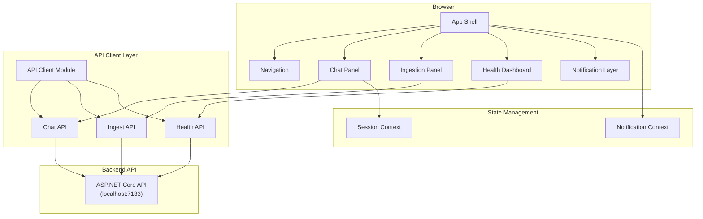
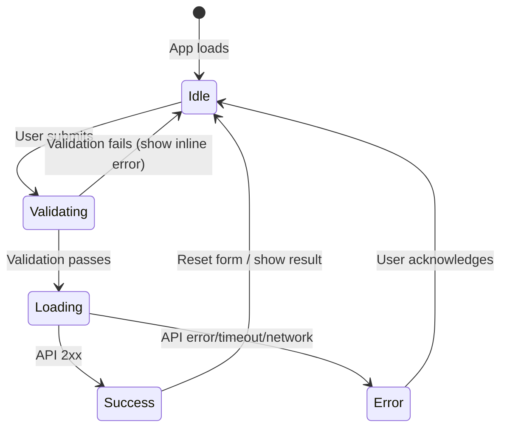
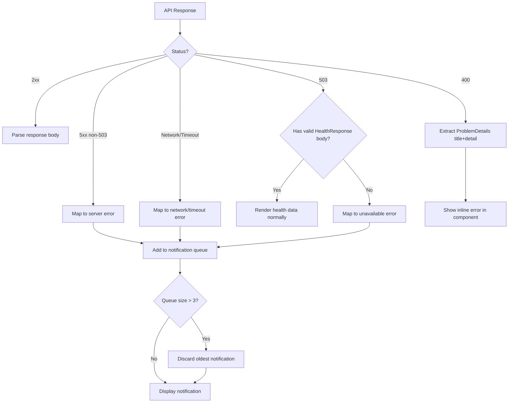

# Design Document: CodeCompass UI

## Overview

The CodeCompass UI is a single-page application (SPA) built with React and TypeScript that serves as the frontend for the CodeCompass .NET 9 API. It provides three primary functional areas: a conversational chat interface for querying indexed documentation/code, an ingestion panel for uploading files and triggering knowledge base indexing, and a health dashboard for monitoring backend service status.

The application communicates exclusively via the existing REST API endpoints and does not require any backend modifications. State is managed entirely client-side within a browser session using React context/state management.

### Technology Choices

| Concern | Choice | Rationale |
|---------|--------|-----------|
| Framework | React 18 + TypeScript 5 | Strong typing, component model, large ecosystem |
| Build Tool | Vite | Fast dev server, ESM-native, minimal config |
| Component Library | Radix UI + Tailwind CSS | Unstyled accessible primitives + utility-first styling |
| HTTP Client | Axios | Interceptors for timeout/error handling, multipart support |
| State Management | React Context + useReducer | Sufficient for session-scoped state without external deps |
| Routing | React Router v6 | Client-side panel navigation with URL sync |
| Testing | Vitest + React Testing Library + fast-check | Unit, integration, and property-based testing |
| Form Validation | Zod | Schema-based validation with TypeScript inference |
| Notifications | Sonner | Lightweight toast notification library with ARIA support |

## Architecture



### Component Architecture

The application follows a layered architecture within the frontend:

1. **Presentation Layer** — React components responsible for rendering UI and handling user interactions
2. **State Layer** — React Context providers managing session state, notification state, and panel state preservation
3. **API Layer** — A centralized HTTP client module with typed request/response interfaces, error interceptors, and timeout handling
4. **Validation Layer** — Zod schemas for client-side input validation before API calls

### Key Design Decisions

1. **No server-side session persistence** — Conversations are ephemeral and tied to the browser session. A page refresh starts a new session (per Requirement 2.6).
2. **Panel state preservation** — React Router outlets combined with component-level state ensure switching panels doesn't destroy form data or conversation history (per Requirement 7.4).
3. **Centralized error handling** — Axios interceptors catch network errors, timeouts, and HTTP error responses, converting them to a uniform error structure that the notification system consumes.
4. **Configurable API base URL** — Loaded from environment variable (`VITE_API_BASE_URL`) at build time, defaulting to `https://localhost:7133`.

## Components and Interfaces

### Component Tree

```
<App>
├── <NotificationProvider>
│   ├── <SessionProvider>
│   │   ├── <AppLayout>
│   │   │   ├── <Navigation />
│   │   │   ├── <Outlet>  (React Router)
│   │   │   │   ├── <ChatPanel />
│   │   │   │   │   ├── <MessageList />
│   │   │   │   │   │   ├── <ChatMessage /> (user)
│   │   │   │   │   │   └── <ChatMessage /> (assistant)
│   │   │   │   │   │       └── <CitationCard />
│   │   │   │   │   ├── <ScrollToBottomIndicator />
│   │   │   │   │   └── <ChatInput />
│   │   │   │   ├── <IngestionPanel />
│   │   │   │   │   ├── <DocIngestionSection />
│   │   │   │   │   │   ├── <FileUploadZone />
│   │   │   │   │   │   └── <IngestionResult />
│   │   │   │   │   ├── <CodeIngestionSection />
│   │   │   │   │   │   ├── <FileUploadZone />
│   │   │   │   │   │   └── <IngestionResult />
│   │   │   │   │   └── <KnowledgeBaseSection />
│   │   │   │   │       └── <IngestionResult />
│   │   │   │   └── <HealthDashboard />
│   │   │   │       ├── <OverallStatus />
│   │   │   │       └── <ServiceStatusCard />
│   │   │   └── <NotificationStack />
```

### API Client Module

```typescript
// src/api/client.ts
interface ApiClientConfig {
  baseUrl: string;
  timeoutMs: number; // 60000
}

// src/api/chat.ts
interface ChatApiRequest {
  question: string;
  sessionId: string;
}

interface ChatApiResponse {
  answer: string;
  citations: Citation[];
  sessionId: string;
}

interface Citation {
  sourceUri: string;
  chunkContent: string;
  relevanceScore: number;
}

function sendChatMessage(request: ChatApiRequest): Promise<ChatApiResponse>;

// src/api/ingest.ts
interface IngestResponse {
  chunksIngested: number;
  sourcesProcessed: number;
}

interface PipelineResult {
  totalFilesProcessed: number;
  totalChunksGenerated: number;
  totalErrors: number;
  elapsedMilliseconds: number;
  filesNewlyIndexed: number;
  filesReIndexed: number;
  filesDeleted: number;
  filesSkipped: number;
  filesFailed: number;
}

function ingestDocs(files: File[]): Promise<IngestResponse>;
function ingestCode(files: File[], repositoryName?: string): Promise<IngestResponse>;
function ingestKnowledgeBase(targetPath: string, mode: 'Full' | 'Incremental'): Promise<PipelineResult>;

// src/api/health.ts
interface HealthResponse {
  status: string;
  services: ServiceHealth[];
}

interface ServiceHealth {
  name: string;
  status: string;
  responseTimeMs: number;
}

function getHealth(): Promise<HealthResponse>;
```

### Session Context

```typescript
// src/contexts/SessionContext.ts
interface SessionState {
  sessionId: string;            // UUID v4
  messages: ChatMessage[];      // Conversation history
}

interface SessionActions {
  sendMessage: (question: string) => Promise<void>;
  newConversation: () => void;
}
```

### Notification Context

```typescript
// src/contexts/NotificationContext.ts
interface AppNotification {
  id: string;
  type: 'success' | 'error';
  title: string;
  message: string;
  dismissible: boolean;
  autoDismissMs?: number;      // 5000 for success
}

interface NotificationActions {
  addNotification: (notification: Omit<AppNotification, 'id'>) => void;
  dismissNotification: (id: string) => void;
}

// Maximum 3 visible at once; oldest discarded when limit exceeded
```

### Validation Schemas

```typescript
// src/validation/schemas.ts
const chatInputSchema = z.object({
  question: z.string().min(1).max(2000).refine(
    (val) => val.trim().length > 0,
    { message: "A question is required" }
  ),
});

const knowledgeBaseSchema = z.object({
  targetPath: z.string().min(1).max(500).refine(
    (val) => val.trim().length > 0,
    { message: "A target directory path is required" }
  ),
  mode: z.enum(['Full', 'Incremental']),
});

const fileUploadSchema = z.object({
  files: z.array(z.instanceof(File))
    .min(1, "At least one file must be selected")
    .max(20, "Maximum 20 files per upload")
    .refine(
      (files) => files.every(f => f.size <= 50 * 1024 * 1024),
      { message: "File exceeds the maximum allowed size of 50 MB" }
    ),
});

const repositoryNameSchema = z.string().max(128).optional();
```

## Data Models

### Client-Side Types

```typescript
// src/types/chat.ts
interface ChatMessage {
  id: string;
  role: 'user' | 'assistant';
  content: string;
  citations?: Citation[];
  timestamp: Date;
}

interface Citation {
  sourceUri: string;
  chunkContent: string;
  relevanceScore: number;
}

// src/types/health.ts
type HealthStatus = 'Healthy' | 'Unhealthy' | 'Degraded';

interface ServiceHealth {
  name: string;
  status: HealthStatus;
  responseTimeMs: number;
}

interface HealthState {
  overallStatus: HealthStatus;
  services: ServiceHealth[];
  lastChecked: Date | null;
  isLoading: boolean;
  error: string | null;
}

// src/types/ingestion.ts
interface FileUploadState {
  files: File[];
  isUploading: boolean;
  result: IngestResult | null;
  error: string | null;
}

interface IngestResult {
  chunksIngested: number;
  sourcesProcessed: number;
}

interface KnowledgeBaseState {
  targetPath: string;
  mode: 'Full' | 'Incremental';
  isProcessing: boolean;
  result: PipelineResult | null;
  error: string | null;
}

// src/types/errors.ts
interface ApiError {
  type: 'network' | 'timeout' | 'validation' | 'server' | 'unavailable';
  title: string;
  detail: string;
}
```

### State Flow Diagrams



### API Error Mapping

| HTTP Status / Condition | ApiError.type | User-Facing Message |
|------------------------|---------------|---------------------|
| Network error | `network` | Server is unavailable. Verify the backend is running. |
| Timeout (>60s) | `timeout` | Request timed out. Please try again. |
| 400 | `validation` | Title + detail from ProblemDetails |
| 503 | `unavailable` | Service temporarily unavailable. |
| 5xx (non-503) | `server` | An unexpected server error occurred. |


## Correctness Properties

*A property is a characteristic or behavior that should hold true across all valid executions of a system—essentially, a formal statement about what the system should do. Properties serve as the bridge between human-readable specifications and machine-verifiable correctness guarantees.*

### Property 1: Chat request body formation

*For any* non-empty, non-whitespace-only string of length 1–2000 and any valid UUID v4 session ID, submitting a chat message SHALL produce a POST request body containing both the exact question string and the exact session ID.

**Validates: Requirements 1.2, 2.3**

### Property 2: Conversation grows by exactly one message pair

*For any* valid ChatResponse returned by the API, appending it to the conversation SHALL increase the message list length by exactly 2 (one user message and one assistant message) with the user message content matching the submitted question and the assistant message content matching the response answer.

**Validates: Requirements 1.3**

### Property 3: Relevance score formatted as whole-number percentage

*For any* citation with a relevance score between 0.0 and 1.0 (inclusive), the formatted display string SHALL equal the score multiplied by 100 and rounded to the nearest integer followed by "%" (e.g., 0.7345 → "73%").

**Validates: Requirements 1.4**

### Property 4: Whitespace-only input rejected by validation

*For any* string composed entirely of whitespace characters (spaces, tabs, newlines, zero-width spaces) of any length including empty string, the validation function SHALL return an error and the submission SHALL be prevented.

**Validates: Requirements 1.6, 5.4**

### Property 5: Error display never leaks internal details

*For any* API error response containing a ProblemDetails body, the user-facing error message SHALL NOT contain HTTP status codes, stack traces, exception type names, or the raw `detail` field from 5xx responses. Only a general-nature description of the failure category SHALL be shown.

**Validates: Requirements 1.8**

### Property 6: Messages rendered in chronological order

*For any* sequence of ChatMessages with timestamps, the rendered message list SHALL display messages ordered by timestamp ascending (oldest at top, newest at bottom), and each message SHALL be identifiable as either user or assistant role.

**Validates: Requirements 2.4**

### Property 7: File upload validation enforces count and size constraints

*For any* set of files where the count exceeds 20 or any individual file size exceeds 50 MB, the validation function SHALL reject the set and return an appropriate error message. For any set of 1–20 files each ≤ 50 MB, validation SHALL pass.

**Validates: Requirements 3.1, 3.8**

### Property 8: File selection display shows accurate count and all names

*For any* non-empty set of selected files (1–20), the display SHALL show the correct total count and include every file name from the selection.

**Validates: Requirements 3.2, 4.2**

### Property 9: IngestResponse values displayed correctly

*For any* valid IngestResponse with non-negative chunksIngested and sourcesProcessed values, both numbers SHALL be displayed in the result area after a successful ingestion operation.

**Validates: Requirements 3.4, 4.4**

### Property 10: ProblemDetails error rendering extracts title and detail

*For any* ProblemDetails response body containing a title and detail field, the error display SHALL render both the title and the detail text to the user.

**Validates: Requirements 3.7, 4.8, 5.5**

### Property 11: PipelineResult displays processing summary

*For any* valid PipelineResult response, the display SHALL render the TotalFilesProcessed, TotalChunksGenerated, and TotalErrors values from the response.

**Validates: Requirements 5.3**

### Property 12: HealthResponse rendering shows all services or empty message

*For any* HealthResponse with a non-empty services array, the dashboard SHALL render one ServiceStatusIndicator per service showing name, status, and response time. For any HealthResponse with an empty services array, the dashboard SHALL display a "no services reported" message. The overall status SHALL always be displayed prominently.

**Validates: Requirements 6.1, 6.3**

### Property 13: Notification queue capped at maximum 3 visible

*For any* sequence of N error notifications added without user dismissal where N > 3, the visible notification count SHALL be exactly 3, and the displayed notifications SHALL be the 3 most recent (oldest discarded first).

**Validates: Requirements 8.9**

### Property 14: User input preserved on API failure

*For any* form state (chat input text, selected files, entered paths) and any API failure (network error, timeout, or server error), the form state after the error SHALL be identical to the form state before the submission attempt.

**Validates: Requirements 8.8**

### Property 15: Auto-scroll triggered by proximity to bottom

*For any* scroll position within 50 pixels of the chat panel bottom when a new message is appended, the panel SHALL auto-scroll to the newest message. For any scroll position more than 50 pixels above the bottom, the panel SHALL NOT auto-scroll and SHALL display a jump-to-bottom indicator.

**Validates: Requirements 9.4, 9.5**

## Error Handling

### Error Classification Strategy

The API Client layer classifies all errors into a uniform `ApiError` type before they reach components:

| Source | Detection | ApiError.type | Persistence |
|--------|-----------|---------------|-------------|
| Network failure | Axios `ERR_NETWORK` | `network` | Persistent (manual dismiss) |
| Request timeout | Axios `ECONNABORTED` | `timeout` | Persistent (manual dismiss) |
| HTTP 400 | Response status | `validation` | Inline (component-level) |
| HTTP 503 | Response status | `unavailable` | Persistent (manual dismiss) |
| HTTP 5xx (non-503) | Response status | `server` | Persistent (manual dismiss) |

### Error Handling Flow



### Component-Level Error Handling

- **Validation errors** (empty input, file too large, etc.) are displayed inline next to the relevant form field using Zod schema validation results.
- **API errors** for ingestion endpoints display the ProblemDetails `title` and `detail` fields within the ingestion section.
- **Chat errors** display a generic message without exposing internals (per Requirement 1.8).

### Input Preservation

On any error, the component state is not reset. The user can:
1. Read the error message
2. Correct their input (if validation error)
3. Retry the same operation (if server/network error)

## Testing Strategy

### Testing Framework

- **Unit/Integration Tests**: Vitest + React Testing Library
- **Property-Based Tests**: fast-check (via Vitest)
- **Accessibility Audit**: axe-core (via @axe-core/react or vitest-axe)

### Dual Testing Approach

**Unit tests** focus on:
- Component rendering with specific props
- Specific user interactions (click, type, keyboard)
- Status-to-color mapping (Healthy→green, Unhealthy→red, Degraded→yellow)
- Loading/disabled states during API calls
- Navigation routing and default view
- Accessibility attributes (ARIA labels, live regions)

**Property-based tests** (fast-check, minimum 100 iterations each) focus on:
- Input validation logic (whitespace rejection, length constraints, file size/count)
- Data formatting (relevance score → percentage)
- State management invariants (message ordering, notification queue cap, conversation growth)
- Error handling (never leak internals, preserve input, ProblemDetails extraction)
- Display correctness (file list accuracy, response value rendering)
- Scroll behavior (threshold-based auto-scroll decision)

**Property test configuration**:
- Library: `fast-check` (npm package)
- Minimum iterations: 100 per property
- Each test tagged with: `Feature: code-compass-ui, Property {number}: {property_text}`

### Test Organization

```
src/
├── __tests__/
│   ├── properties/           # Property-based tests
│   │   ├── chat.property.test.ts
│   │   ├── validation.property.test.ts
│   │   ├── ingestion.property.test.ts
│   │   ├── health.property.test.ts
│   │   ├── notifications.property.test.ts
│   │   └── scroll.property.test.ts
│   ├── unit/                 # Example-based unit tests
│   │   ├── ChatPanel.test.tsx
│   │   ├── IngestionPanel.test.tsx
│   │   ├── HealthDashboard.test.tsx
│   │   ├── Navigation.test.tsx
│   │   └── ApiClient.test.ts
│   └── integration/          # Component integration tests
│       ├── ChatFlow.test.tsx
│       └── IngestionFlow.test.tsx
```

### Coverage Goals

- All 15 correctness properties implemented as property-based tests
- Unit tests for all component rendering states
- Integration tests for end-to-end user flows (chat submission, file upload, health check)
- Accessibility audit run as part of CI
