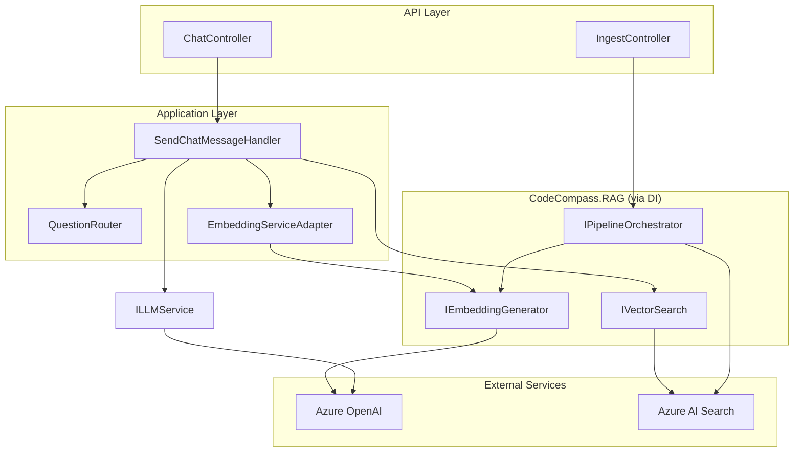
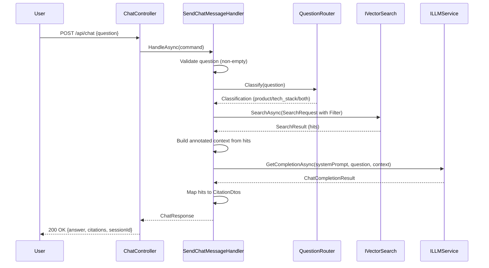

# Design Document: RAG Knowledge Base Integration

## Overview

This design describes how CodeCompass.API integrates with the CodeCompass.RAG library to replace placeholder implementations with production-grade RAG-powered search and answer generation. The integration enables semantic search across two knowledge bases (Product and Tech Stack) with intelligent question routing, real Azure OpenAI embeddings, Azure AI Search vector retrieval, and grounded LLM answer generation with citations.

The core approach uses the **Adapter Pattern** to bridge the RAG library's interfaces into the API's existing Clean Architecture, and introduces a **Question Router** component for keyword-based classification that determines which knowledge base(s) to query.

## Architecture



### Modified Chat Flow



## Components and Interfaces

### 1. EmbeddingServiceAdapter

Bridges the RAG library's `IEmbeddingGenerator` to the API's `IEmbeddingService` interface using the Adapter Pattern.

```csharp
namespace CodeCompassProject.CodeCompass.Repository.Services;

public class EmbeddingServiceAdapter : IEmbeddingService
{
    private readonly IEmbeddingGenerator _embeddingGenerator;

    public EmbeddingServiceAdapter(IEmbeddingGenerator embeddingGenerator)
    {
        _embeddingGenerator = embeddingGenerator;
    }

    public Task<float[]> GetEmbeddingAsync(string text, CancellationToken cancellationToken = default)
        => _embeddingGenerator.GenerateEmbeddingAsync(text, cancellationToken);

    public async Task<IEnumerable<float[]>> GetEmbeddingsAsync(
        IEnumerable<string> texts, CancellationToken cancellationToken = default)
    {
        var textList = texts.ToList();
        var results = await _embeddingGenerator.GenerateEmbeddingsBatchAsync(textList, cancellationToken);
        return results;
    }
}
```

**Rationale:** The adapter keeps `IEmbeddingService` as the Application-layer contract. Existing code that depends on `IEmbeddingService` (like the health check handler) continues to work without modification. The RAG library's `IEmbeddingGenerator` is the actual implementation, registered by `AddCodeCompassPipeline`.

### 2. IQuestionRouter Interface

New Application-layer interface for question classification:

```csharp
namespace CodeCompassProject.CodeCompass.Application.Interfaces;

public interface IQuestionRouter
{
    QuestionClassification Classify(string question);
}

public enum QuestionClassification
{
    Product,
    TechStack,
    Both
}
```

### 3. KeywordQuestionRouter Implementation

Repository-layer implementation using keyword matching:

```csharp
namespace CodeCompassProject.CodeCompass.Repository.Services;

public class KeywordQuestionRouter : IQuestionRouter
{
    private static readonly HashSet<string> ProductKeywords = new(StringComparer.OrdinalIgnoreCase)
    {
        "CLO", "CDO", "compliance", "waterfall", "trading",
        "portfolio management", "tranches", "overcollateralization", "reporting"
    };

    private static readonly HashSet<string> TechStackKeywords = new(StringComparer.OrdinalIgnoreCase)
    {
        "React", "micro-frontends", ".NET", "microservices", "gRPC",
        "Kubernetes", "CI/CD", "Docker", "deployment pipelines"
    };

    public QuestionClassification Classify(string question)
    {
        if (string.IsNullOrWhiteSpace(question))
            return QuestionClassification.Both;

        var matchesProduct = ProductKeywords.Any(kw =>
            question.Contains(kw, StringComparison.OrdinalIgnoreCase));
        var matchesTechStack = TechStackKeywords.Any(kw =>
            question.Contains(kw, StringComparison.OrdinalIgnoreCase));

        return (matchesProduct, matchesTechStack) switch
        {
            (true, true) => QuestionClassification.Both,
            (true, false) => QuestionClassification.Product,
            (false, true) => QuestionClassification.TechStack,
            (false, false) => QuestionClassification.Both
        };
    }
}
```

**Rationale:** Keyword matching is deterministic, fast (well under 100ms), and testable. It uses `string.Contains` with `OrdinalIgnoreCase` for case-insensitive matching. The default-to-both strategy ensures no question goes unserved.

### 4. Modified SendChatMessageHandler

The handler's dependencies change from `IVectorStore` + `IEmbeddingService` for search to `IVectorSearch` + `IQuestionRouter`:

```csharp
public class SendChatMessageHandler : ICommandHandler<SendChatMessageCommand, ChatResponse>
{
    private readonly IVectorSearch _vectorSearch;
    private readonly IQuestionRouter _questionRouter;
    private readonly ILLMService _llmService;
    private readonly ILogger<SendChatMessageHandler> _logger;
    private readonly KnowledgeBasesSettings _knowledgeBasesSettings;

    // Constructor injection with IVectorSearch replacing IVectorStore + IEmbeddingService
}
```

**Key changes:**
- Removes `IEmbeddingService` dependency (IVectorSearch handles embedding internally)
- Removes `IVectorStore` dependency (replaced by IVectorSearch)
- Adds `IQuestionRouter` for classification
- Adds `KnowledgeBasesSettings` for path prefix resolution

### 5. Updated DI Registration (DependencyInjection.cs)

```csharp
public static IServiceCollection AddInfrastructureServices(
    this IServiceCollection services, IConfiguration configuration)
{
    // Register RAG pipeline (parsers, embedding, search, indexing)
    services.AddCodeCompassPipeline(configuration);

    // Configuration
    services.Configure<KnowledgeBasesSettings>(
        configuration.GetSection(KnowledgeBasesSettings.SectionName));

    // Adapter: IEmbeddingService delegates to IEmbeddingGenerator (registered by RAG)
    services.AddScoped<IEmbeddingService, EmbeddingServiceAdapter>();

    // Question routing
    services.AddSingleton<IQuestionRouter, KeywordQuestionRouter>();

    // LLM (keeps existing implementation, will be replaced with real Azure OpenAI later)
    services.AddScoped<ILLMService, AzureOpenAILLMService>();

    // CQRS Handlers
    services.AddScoped<ICommandHandler<SendChatMessageCommand, ChatResponse>, SendChatMessageHandler>();
    // ... other handlers ...

    // Startup validation
    services.AddHostedService<ConfigurationValidationHostedService>();

    return services;
}
```

**Key decisions:**
- `AddCodeCompassPipeline` is called first, registering `IEmbeddingGenerator`, `IVectorSearch`, `IPipelineOrchestrator`, etc.
- `InMemoryVectorStore` registration is removed entirely.
- `EmbeddingServiceAdapter` bridges the old interface for backward compatibility.
- The handler now takes `IVectorSearch` directly (from RAG) rather than `IVectorStore`.

### 6. Ingestion Pipeline Endpoint

The IngestController gets a new endpoint for knowledge base ingestion via the RAG pipeline:

```csharp
[HttpPost("knowledge-base")]
public async Task<ActionResult<PipelineResult>> IngestKnowledgeBase(
    [FromBody] IngestKnowledgeBaseRequest request,
    CancellationToken cancellationToken)
{
    var pipelineRequest = new PipelineRequest(request.TargetPath, request.Mode);
    var result = await _pipelineOrchestrator.RunAsync(pipelineRequest, cancellationToken);
    return Ok(result);
}
```

### 7. ConfigurationValidationHostedService

A hosted service that validates required configuration at startup:

```csharp
public class ConfigurationValidationHostedService : IHostedService
{
    public Task StartAsync(CancellationToken cancellationToken)
    {
        // Validate AzureOpenAI, AzureSearch, KnowledgeBases sections
        // Throw if any required value is missing or empty
    }

    public Task StopAsync(CancellationToken cancellationToken) => Task.CompletedTask;
}
```

## Data Models

### Configuration Models

```csharp
// New configuration model for knowledge base path mappings
public class KnowledgeBasesSettings
{
    public const string SectionName = "KnowledgeBases";
    public KnowledgeBaseEntry Product { get; set; } = new();
    public KnowledgeBaseEntry TechStack { get; set; } = new();
}

public class KnowledgeBaseEntry
{
    public string SourcePathPrefix { get; set; } = string.Empty;
}
```

### Updated appsettings.json Structure

```json
{
  "AzureOpenAI": {
    "Endpoint": "https://your-resource.openai.azure.com/",
    "ApiKey": "your-api-key",
    "DeploymentName": "gpt-4",
    "EmbeddingDeploymentName": "text-embedding-ada-002"
  },
  "AzureSearch": {
    "Endpoint": "https://your-search.search.windows.net",
    "ApiKey": "your-search-api-key",
    "IndexName": "codecompass-index"
  },
  "KnowledgeBases": {
    "Product": {
      "SourcePathPrefix": "Solvas_AM_Classic_Product_Knowledge_Base"
    },
    "TechStack": {
      "SourcePathPrefix": "Solvas_AM_Modern_Platform_Tech_Stack_Knowledge_Base"
    }
  },
  "Ingestion": {
    "MaxChunkSize": 512,
    "ChunkOverlap": 50
  }
}
```

### Request/Response DTOs

```csharp
// New request for knowledge base ingestion
public class IngestKnowledgeBaseRequest
{
    public string TargetPath { get; set; } = string.Empty;
    public IndexingMode Mode { get; set; } = IndexingMode.Full;
}

// PipelineResult is returned directly from CodeCompass.RAG
```

### Data Flow Mapping

| RAG Model | API Model | Mapping |
|-----------|-----------|---------|
| `SearchHit.ChunkText` | `CitationDto.ChunkContent` | Truncate to 200 chars + "..." if exceeding |
| `SearchHit.RelevanceScore` | `CitationDto.RelevanceScore` | Direct float mapping |
| `SearchHit.Metadata.SourceFilePath` | `CitationDto.SourceUri` | Direct string mapping |
| `SearchResult.Hits` | Context chunks for LLM | Extract `ChunkText` from each hit |
| `PipelineResult` | HTTP response body | Direct serialization |

## Correctness Properties

*A property is a characteristic or behavior that should hold true across all valid executions of a system — essentially, a formal statement about what the system should do. Properties serve as the bridge between human-readable specifications and machine-verifiable correctness guarantees.*

### Property 1: Empty/whitespace question rejection

*For any* string that is null, empty, or composed entirely of whitespace characters, submitting it as a question to the SendChatMessageHandler SHALL result in a rejection (400 error response) and the handler SHALL NOT invoke IVectorSearch or ILLMService.

**Validates: Requirements 1.5, 3.8**

### Property 2: Question classification correctness

*For any* question string, the QuestionRouter SHALL classify it according to keyword presence: if the question contains at least one product keyword and no tech stack keywords, the result SHALL be `Product`; if it contains at least one tech stack keyword and no product keywords, the result SHALL be `TechStack`; if it contains keywords from both sets OR no keywords from either set, the result SHALL be `Both`. Classification SHALL be case-insensitive.

**Validates: Requirements 3.1, 3.2, 3.3, 3.5, 3.6, 3.7**

### Property 3: Question classification performance

*For any* question string of any length, the QuestionRouter.Classify method SHALL return a result within 100 milliseconds.

**Validates: Requirements 3.9**

### Property 4: "Both" classification merge, sort, and cap

*For any* two SearchResult collections (one from Product KB, one from Tech Stack KB), when classification is "Both", merging the hits and ordering by RelevanceScore descending SHALL produce a list where each element's RelevanceScore is greater than or equal to the next element's RelevanceScore, and the list length SHALL be at most K (where K equals the configured top-K value, currently 5).

**Validates: Requirements 3.4**

### Property 5: Context construction from search hits

*For any* non-empty SearchResult, the context string list passed to ILLMService.GetCompletionAsync SHALL contain exactly one entry per SearchHit, and each entry SHALL contain the SearchHit.ChunkText annotated with the knowledge base origin identifier (derived from SourceFilePath matching against configured KnowledgeBases path prefixes).

**Validates: Requirements 2.3, 6.2**

### Property 6: Citation field mapping correctness

*For any* SearchHit, the corresponding CitationDto SHALL satisfy: (a) SourceUri equals SearchHit.Metadata.SourceFilePath, (b) RelevanceScore equals SearchHit.RelevanceScore as a float in [0.0, 1.0], (c) if ChunkText length > 200, ChunkContent equals the first 200 characters followed by "...", (d) if ChunkText length ≤ 200 and is non-null/non-empty, ChunkContent equals ChunkText unchanged, (e) if ChunkText is null or empty, ChunkContent equals empty string.

**Validates: Requirements 2.4, 7.2, 7.3, 7.4, 7.5, 7.6**

### Property 7: Citation count and ordering invariant

*For any* SearchResult with N hits (N ≥ 0), the ChatResponse.Citations list SHALL contain exactly N elements, ordered by RelevanceScore descending.

**Validates: Requirements 7.1**

## Error Handling

### Error Categories and HTTP Status Codes

| Error Scenario | HTTP Status | Error Source | Handling Location |
|---|---|---|---|
| Empty/null question | 400 | Input validation | SendChatMessageHandler |
| Empty embedding vector | 502 | IEmbeddingGenerator | SendChatMessageHandler |
| Embedding generation failure | 503 | Azure OpenAI | GlobalExceptionMiddleware |
| Vector search unreachable | 503 | Azure AI Search | GlobalExceptionMiddleware |
| LLM completion failure | 503 | Azure OpenAI | GlobalExceptionMiddleware |
| LLM returns empty content | 200 (fallback) | ILLMService | SendChatMessageHandler |
| Zero search results | 200 (informative) | IVectorSearch | SendChatMessageHandler |
| Invalid ingestion path | 404 | IPipelineOrchestrator | GlobalExceptionMiddleware |
| Missing configuration | Startup failure | Configuration | ConfigurationValidationHostedService |

### Error Handling Strategy

1. **Input validation** happens first in the handler. Invalid input returns immediately without calling downstream services.

2. **Service failures** (embedding, search, LLM) propagate exceptions that the existing `GlobalExceptionMiddleware` converts to RFC 7807 ProblemDetails with appropriate status codes. The RAG library's `RetryPolicy` handles transient failures with retries before exceptions propagate.

3. **Graceful degradation** for non-fatal conditions:
   - Zero search results → LLM called with empty context, response indicates no relevant info found
   - Empty LLM content → Response with fallback message explaining no answer could be generated
   - Partial ingestion errors → PipelineResult returned with error count (no exception)

4. **Exception type mapping** in GlobalExceptionMiddleware:
   ```csharp
   HttpRequestException → 503 (service unavailable)
   TaskCanceledException → 503 (timeout)
   DirectoryNotFoundException → 404
   ArgumentException → 400
   ```

### Retry Strategy

The CodeCompass.RAG library's `RetryPolicy` (registered as Singleton) handles transient failures for Azure services. The API layer does not add its own retry logic — it relies on the RAG library's built-in resilience. If retries are exhausted, the exception propagates to the middleware.

## Testing Strategy

### Property-Based Testing

This feature is suitable for property-based testing because:
- The QuestionRouter has pure function behavior with a large input space (any string)
- The citation mapping is a pure transformation with clear invariants
- The merge/sort/cap logic for "both" classification is algorithmic

**Library:** [FsCheck.Xunit](https://github.com/fscheck/FsCheck) (mature PBT library for .NET)

**Configuration:**
- Minimum 100 iterations per property test
- Each test tagged with property reference comment

**Tag format:** `Feature: rag-knowledge-base-integration, Property {N}: {title}`

### Test Organization

```
CodeCompassProject.CodeCompass.Test/
├── Properties/
│   ├── QuestionRouterProperties.cs      (Properties 2, 3)
│   ├── CitationMappingProperties.cs     (Properties 6, 7)
│   ├── ContextConstructionProperties.cs (Property 5)
│   ├── MergeAndSortProperties.cs        (Property 4)
│   └── InputValidationProperties.cs     (Property 1)
├── Unit/
│   ├── SendChatMessageHandlerTests.cs
│   ├── EmbeddingServiceAdapterTests.cs
│   └── ConfigurationValidationTests.cs
└── Integration/
    ├── DependencyInjectionTests.cs
    ├── IngestionPipelineTests.cs
    └── EndToEndChatTests.cs
```

### Unit Tests (Example-Based)

Cover specific scenarios not captured by properties:
- Handler returns 503 when ILLMService throws
- Handler returns fallback answer when LLM returns empty content
- Handler returns "no relevant information" when search returns zero results
- Configuration validation fails with descriptive message for each missing value
- EmbeddingServiceAdapter correctly delegates to IEmbeddingGenerator
- System prompt contains citation instructions
- DI container resolves all required services

### Integration Tests

Cover external service wiring:
- AddCodeCompassPipeline registers all expected services
- Ingestion pipeline processes knowledge base files correctly
- End-to-end chat flow with real (or emulated) Azure services
- Request logging middleware captures expected fields

### Test Doubles

- **Mock IVectorSearch**: Returns configurable SearchResult for handler unit tests
- **Mock ILLMService**: Returns configurable ChatCompletionResult
- **Mock IEmbeddingGenerator**: Returns fixed-length float arrays
- **Mock IPipelineOrchestrator**: Returns configurable PipelineResult

