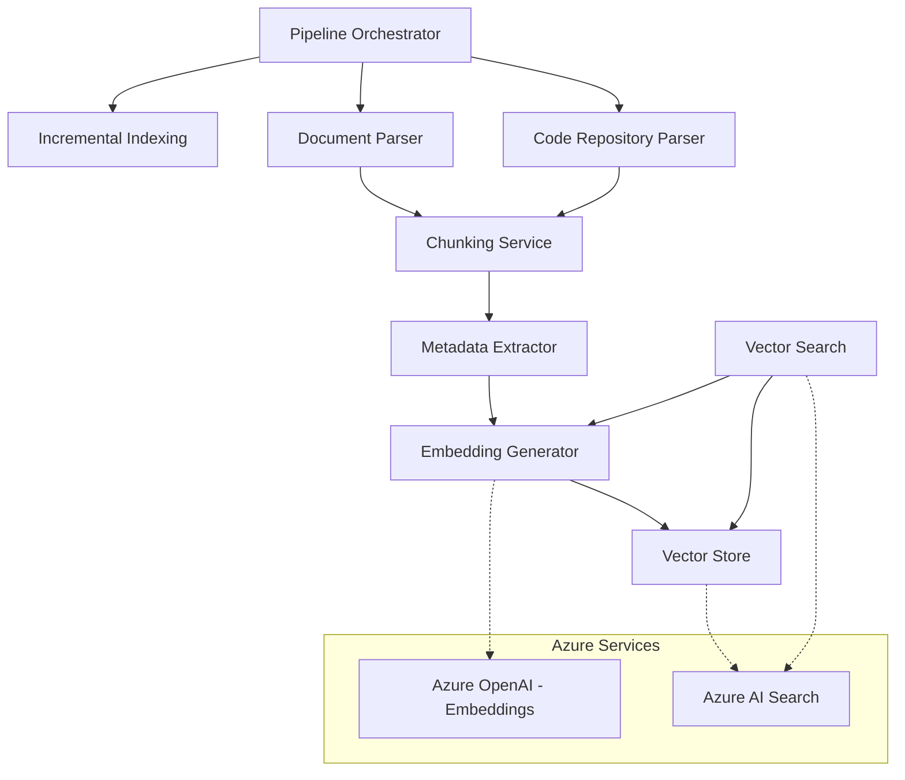

# Design Document: RAG Pipeline

## Overview

CodeCompass is a Retrieval Augmented Generation (RAG) pipeline built on .NET 8 targeting enterprise documentation environments. The system orchestrates a multi-stage pipeline: document/code parsing → intelligent chunking → embedding generation → vector storage → semantic retrieval. It leverages Azure OpenAI for embeddings and Azure AI Search as the vector store.

The architecture emphasizes:
- **Modularity**: Each pipeline stage is an independent, testable component behind a clean interface.
- **Resilience**: Retry logic with exponential backoff at every external service boundary.
- **Scalability**: Parallel ingestion, configurable batch sizes, and incremental indexing for enterprise-scale repositories.
- **Extensibility**: New document formats or code languages can be added by implementing parser interfaces.

## Architecture

The pipeline follows a staged data-flow architecture with a central orchestrator coordinating each stage.



### Data Flow

1. **Orchestrator** receives a request (full or incremental) with a target path.
2. **Incremental Indexing** (if incremental mode) determines which files are new/modified/deleted.
3. **Parsers** extract structured content from each file based on its type.
4. **Chunking Service** splits parsed content into semantically coherent chunks respecting logical boundaries.
5. **Metadata Extractor** enriches each chunk with contextual metadata.
6. **Embedding Generator** converts chunks to vectors via Azure OpenAI in batches.
7. **Vector Store** persists embeddings and metadata to Azure AI Search.
8. **Vector Search** handles query-time retrieval by embedding queries and executing similarity search.

## Components and Interfaces

### IPipelineOrchestrator

The top-level entry point that coordinates the full pipeline.

```csharp
public interface IPipelineOrchestrator
{
    Task<PipelineResult> RunAsync(PipelineRequest request, CancellationToken cancellationToken = default);
}

public record PipelineRequest(string TargetPath, IndexingMode Mode);

public enum IndexingMode { Full, Incremental }

public record PipelineResult(
    int TotalFilesProcessed,
    int TotalChunksGenerated,
    int TotalErrors,
    long ElapsedMilliseconds,
    int FilesNewlyIndexed,
    int FilesReIndexed,
    int FilesDeleted,
    int FilesSkipped,
    int FilesFailed);
```

### IDocumentParser

Handles parsing of document files (Markdown, PDF, DOCX).

```csharp
public interface IDocumentParser
{
    bool CanParse(string fileExtension);
    Task<ParsedDocument> ParseAsync(string filePath, CancellationToken cancellationToken = default);
}

public record ParsedDocument(
    string RawText,
    IReadOnlyList<Heading> Headings,
    SourceFileMetadata SourceMetadata);

public record Heading(int Level, string Text);

public record SourceFileMetadata(
    string FilePath,
    string FileName,
    string FileExtension,
    DateTimeOffset LastModified);
```

### ICodeParser

Handles parsing of code repository files (C#, JSX/TSX, SQL).

```csharp
public interface ICodeParser
{
    bool CanParse(string fileExtension);
    Task<ParsedCode> ParseAsync(string filePath, CancellationToken cancellationToken = default);
}

public record ParsedCode(
    string RawText,
    IReadOnlyList<CodeSymbol> Symbols,
    IReadOnlyList<string> DocumentationComments,
    SourceFileMetadata SourceMetadata);

public record CodeSymbol(string Name, CodeSymbolKind Kind, string? ParentName);

public enum CodeSymbolKind { Class, Method, Component, Hook, StoredProcedure, Parameter }
```

### IChunkingService

Splits parsed content into chunks respecting semantic boundaries.

```csharp
public interface IChunkingService
{
    IReadOnlyList<Chunk> ChunkDocument(ParsedDocument document, ChunkingOptions? options = null);
    IReadOnlyList<Chunk> ChunkCode(ParsedCode code, ChunkingOptions? options = null);
}

public record ChunkingOptions(
    int MaxTokens = 512,
    int MinTokens = 50,
    int OverlapTokens = 50);

public record Chunk(
    string Text,
    int Index,
    string? ContextHeader,
    ChunkMetadata Metadata);

public record ChunkMetadata(
    string SourceFilePath,
    int ChunkIndex,
    string ContentType,
    string? Language,
    DateTimeOffset LastModified,
    string? SectionHeading);
```

### IEmbeddingGenerator

Converts text chunks into vector embeddings via Azure OpenAI.

```csharp
public interface IEmbeddingGenerator
{
    Task<float[]> GenerateEmbeddingAsync(string text, CancellationToken cancellationToken = default);
    Task<IReadOnlyList<float[]>> GenerateEmbeddingsBatchAsync(
        IReadOnlyList<string> texts, CancellationToken cancellationToken = default);
}
```

### IVectorStore

Persists and manages vector embeddings in Azure AI Search.

```csharp
public interface IVectorStore
{
    Task UpsertAsync(IReadOnlyList<VectorDocument> documents, CancellationToken cancellationToken = default);
    Task DeleteBySourceFileAsync(string sourceFilePath, CancellationToken cancellationToken = default);
}

public record VectorDocument(
    string Id,
    float[] Embedding,
    string ChunkText,
    ChunkMetadata Metadata);
```

### IVectorSearch

Executes semantic similarity queries.

```csharp
public interface IVectorSearch
{
    Task<SearchResult> SearchAsync(SearchRequest request, CancellationToken cancellationToken = default);
}

public record SearchRequest(
    string Query,
    int TopK = 5,
    SearchFilter? Filter = null);

public record SearchFilter(
    string? ContentType = null,
    string? Language = null,
    string? SourcePathPrefix = null);

public record SearchResult(
    IReadOnlyList<SearchHit> Hits,
    int TotalCount);

public record SearchHit(
    string ChunkText,
    float RelevanceScore,
    ChunkMetadata Metadata);
```

### IMetadataExtractor

Extracts and enriches metadata from parsed content.

```csharp
public interface IMetadataExtractor
{
    ChunkMetadata ExtractDocumentMetadata(ParsedDocument document, int chunkIndex, string? nearestHeading);
    ChunkMetadata ExtractCodeMetadata(ParsedCode code, int chunkIndex, string? containingSymbol);
}
```

### IIncrementalIndexingService

Manages change detection and state tracking for incremental indexing.

```csharp
public interface IIncrementalIndexingService
{
    Task<IndexingPlan> ComputePlanAsync(string targetPath, CancellationToken cancellationToken = default);
    Task UpdateStateAsync(string filePath, DateTimeOffset lastModified, CancellationToken cancellationToken = default);
    Task RemoveStateAsync(string filePath, CancellationToken cancellationToken = default);
}

public record IndexingPlan(
    IReadOnlyList<string> NewFiles,
    IReadOnlyList<string> ModifiedFiles,
    IReadOnlyList<string> DeletedFiles,
    IReadOnlyList<string> UnchangedFiles);
```

## Data Models

### Azure AI Search Index Schema

The vector index stores each chunk as a document with the following fields:

| Field | Type | Description |
|-------|------|-------------|
| `id` | `Edm.String` (Key) | Deterministic ID derived from `sourceFilePath` + `chunkIndex` |
| `embedding` | `Collection(Edm.Single)` | Vector representation (dimension matches model output) |
| `chunkText` | `Edm.String` | The full text of the chunk |
| `sourceFilePath` | `Edm.String` (Filterable) | Path to the source file (max 1024 chars) |
| `chunkIndex` | `Edm.Int32` (Filterable) | Zero-based position index within the source file |
| `contentType` | `Edm.String` (Filterable) | "document" or "code" |
| `language` | `Edm.String` (Filterable) | Programming language or document format |
| `lastModified` | `Edm.DateTimeOffset` (Filterable, Sortable) | ISO 8601 UTC timestamp |
| `sectionHeading` | `Edm.String` | Nearest heading or class/method signature (max 512 chars) |

### Indexing State Record

The incremental indexing state is persisted as a JSON file:

```json
{
  "version": 1,
  "lastRunTimestamp": "2024-01-15T10:30:00Z",
  "files": {
    "/path/to/file.md": {
      "lastModified": "2024-01-14T08:00:00Z",
      "chunkCount": 12
    }
  }
}
```

### Configuration Model

```csharp
public record PipelineConfiguration(
    AzureOpenAISettings AzureOpenAI,
    AzureSearchSettings AzureSearch,
    ChunkingOptions Chunking,
    IngestionSettings Ingestion);

public record AzureOpenAISettings(
    string Endpoint,
    string DeploymentName,
    string ApiKey,
    int EmbeddingDimension = 1536);

public record AzureSearchSettings(
    string Endpoint,
    string IndexName,
    string ApiKey,
    int BatchSize = 100);

public record IngestionSettings(
    int ConcurrencyLevel = 4,
    int EmbeddingBatchSize = 16,
    int MaxFileSizeMB = 50);
```

### Document ID Generation

The document ID in the search index is generated deterministically to enable upsert-on-match behavior:

```csharp
// ID = Base64Url(SHA256(sourceFilePath + "|" + chunkIndex))
// This ensures the same file+chunk always maps to the same document ID.
```

## Correctness Properties

*A property is a characteristic or behavior that should hold true across all valid executions of a system—essentially, a formal statement about what the system should do. Properties serve as the bridge between human-readable specifications and machine-verifiable correctness guarantees.*

### Property 1: Parser output structure invariant

*For any* valid input file (document or code) that is successfully parsed, the resulting output SHALL contain non-null raw text, a list of headings/symbols (possibly empty), and complete source file metadata with file path, file name, file extension, and last modified timestamp all populated.

**Validates: Requirements 1.5, 2.7**

### Property 2: File validation and dispatch

*For any* file path provided to the parser, if the file extension is in the supported set (.md, .pdf, .docx, .cs, .jsx, .tsx, .sql) and size is ≤ 50 MB, the parser SHALL accept and process it. If the extension is not in the supported set, the parser SHALL return an error containing that extension. If the file exceeds 50 MB, the parser SHALL return a size error.

**Validates: Requirements 1.4, 1.7**

### Property 3: Markdown heading extraction

*For any* Markdown document containing heading markers (# through ######), the parser SHALL extract each heading with its correct level (1–6) and text content, and the number of extracted headings SHALL equal the number of heading markers in the source.

**Validates: Requirements 1.1**

### Property 4: Repository file enumeration by extension

*For any* directory tree provided as a repository path, the file enumeration SHALL return exactly those files with extensions .cs, .jsx, .tsx, or .sql, and no files with other extensions.

**Validates: Requirements 2.1**

### Property 5: Code parsing resilience to syntax errors

*For any* batch of source files where some contain syntax errors, the parser SHALL produce results for all parseable files and log warnings for unparseable files, never halting the batch due to individual file failures.

**Validates: Requirements 2.5**

### Property 6: Document chunking respects paragraph boundaries

*For any* parsed document where individual paragraphs fit within the maximum chunk size, no chunk boundary SHALL fall within a paragraph—each paragraph appears entirely within a single chunk.

**Validates: Requirements 3.1**

### Property 7: Code chunking respects logical boundaries

*For any* parsed code file where individual logical units (classes, methods, functions, procedures) fit within the maximum chunk size, no chunk boundary SHALL fall within a logical unit—each unit appears entirely within a single chunk.

**Validates: Requirements 3.2**

### Property 8: Chunk size bounds invariant

*For any* input text and valid chunking configuration, every produced chunk SHALL have a token count greater than or equal to the configured minimum and less than or equal to the configured maximum.

**Validates: Requirements 3.3**

### Property 9: Chunk overlap invariant

*For any* chunking output producing two or more chunks, the token overlap between each pair of adjacent chunks SHALL equal the configured overlap size, and the configured overlap SHALL not exceed 25% of the maximum chunk size.

**Validates: Requirements 3.4**

### Property 10: Sequential chunk indexing

*For any* chunking output from a single source, chunk indices SHALL form a zero-based contiguous sequence (0, 1, 2, ..., n-1) and each chunk SHALL reference the correct source file path in its metadata.

**Validates: Requirements 3.5**

### Property 11: Oversized unit splitting with context header

*For any* logical unit (paragraph or code block) that exceeds the maximum chunk size, the chunking service SHALL split it at sentence boundaries (for documents) or statement boundaries (for code), and each resulting sub-chunk SHALL be prepended with the nearest ancestor heading or enclosing declaration signature as a context header.

**Validates: Requirements 3.6**

### Property 12: Batching correctness

*For any* list of N items and a configured batch size B (where B is within valid bounds), batching SHALL produce ⌈N/B⌉ groups, each group containing at most B items, with every input item appearing in exactly one batch and the original order preserved.

**Validates: Requirements 4.2, 9.3, 9.4**

### Property 13: Vector normalization to unit length

*For any* embedding vector produced by the EmbeddingGenerator, the L2 norm of the output vector SHALL equal 1.0 (within floating-point tolerance of ±1e-6).

**Validates: Requirements 4.5**

### Property 14: Deterministic document ID generation

*For any* source file path and chunk index pair, the generated document ID SHALL be deterministic (identical inputs always produce identical IDs) and collision-resistant (distinct inputs produce distinct IDs).

**Validates: Requirements 5.2**

### Property 15: Vector dimension validation

*For any* vector submitted to the VectorStore, if its dimensionality matches the configured embedding model output size, it SHALL be accepted. If its dimensionality does not match, it SHALL be rejected with a validation error.

**Validates: Requirements 5.6**

### Property 16: Input validation for queries and pipeline parameters

*For any* query string, if its length is between 1 and 2000 characters it SHALL be accepted for search. If its length is 0 or exceeds 2000, it SHALL be rejected. *For any* K parameter, values in [1, 50] SHALL be accepted and values outside SHALL be rejected. *For any* mode parameter, only "full" and "incremental" SHALL be accepted.

**Validates: Requirements 6.1, 6.3, 10.5**

### Property 17: Search result ordering and completeness

*For any* search query returning results, the hits SHALL be ordered by descending relevance score, each relevance score SHALL be in the range [0.0, 1.0], each hit SHALL contain non-empty chunk text, and each hit SHALL contain all metadata fields (source file path, chunk index, content type, language, last modified timestamp, section heading).

**Validates: Requirements 6.2, 6.4**

### Property 18: Metadata filter restricts results

*For any* search query with a metadata filter applied, every returned hit SHALL satisfy the filter criteria—if filtering by content type, all results have that content type; if filtering by language, all results have that language; if filtering by source path prefix, all results have a source path starting with that prefix.

**Validates: Requirements 6.5**

### Property 19: Metadata extraction completeness

*For any* parsed content (document or code), the metadata extractor SHALL produce a ChunkMetadata object with all VectorStore schema fields populated. For documents with headings, the nearest ancestor heading hierarchy SHALL be correctly assigned to each chunk based on its position. For code files, the programming language, namespace, and containing class/component SHALL additionally be populated.

**Validates: Requirements 7.1, 7.2, 7.3, 7.4**

### Property 20: Indexing state round-trip

*For any* valid indexing state record, serializing it to the persistent format and then deserializing it back SHALL produce an equivalent record with identical file paths, timestamps, and chunk counts.

**Validates: Requirements 8.1**

### Property 21: Change detection classification

*For any* set of current files on disk and a stored indexing state, the change detection algorithm SHALL correctly classify every file: files present on disk but absent from state are "new," files present in both but with a newer timestamp on disk are "modified," files present in state but absent from disk are "deleted," and files present in both with matching timestamps are "unchanged." The union of all categories SHALL equal the union of files on disk and files in state.

**Validates: Requirements 8.2, 8.3, 8.5**

### Property 22: Resilience—failed files don't halt or corrupt state

*For any* batch of files being processed where some fail (due to parse errors, embedding errors, or storage errors), the pipeline SHALL continue processing all remaining files, SHALL not update the indexing state for failed files, and SHALL produce results for all files that did not fail.

**Validates: Requirements 4.4, 8.8, 9.6**

### Property 23: Summary counts consistency

*For any* completed indexing run, the summary counts SHALL satisfy: newly indexed + re-indexed + deleted + skipped + failed = total files considered, all counts SHALL be non-negative, and elapsed time SHALL be a positive integer in milliseconds.

**Validates: Requirements 8.9, 10.3**

### Property 24: Full mode processes all supported files

*For any* directory tree and a full indexing request, the pipeline SHALL process every file with a supported extension (.md, .pdf, .docx, .cs, .jsx, .tsx, .sql) found recursively within the target path, and no files with unsupported extensions.

**Validates: Requirements 10.1**

## Error Handling

### Retry Strategy

All external service calls (Azure OpenAI, Azure AI Search) use a consistent retry strategy:

| Parameter | Value |
|-----------|-------|
| Max attempts | 3 |
| Base delay | 1 second |
| Max delay | 8 seconds |
| Backoff multiplier | 2x (exponential) |
| Retryable errors | Rate limits (429), transient server errors (500, 502, 503, 504) |
| Non-retryable errors | Authentication (401), validation (400), not found (404) |

### Error Propagation Rules

1. **File-level failures are isolated**: A single file failing to parse, chunk, embed, or store does not halt the pipeline. The failure is logged and the file is skipped.
2. **Fatal errors halt the pipeline**: If the target path is inaccessible, Azure services are completely unavailable after retries, or a configuration error is detected, the pipeline halts and returns a partial summary.
3. **State consistency on failure**: The indexing state record is only updated for files that complete all pipeline stages successfully. Failed files retain their previous state (or no state for new files), ensuring they are retried on the next run.
4. **Query errors return error indicators**: Search failures due to embedding generation failure or index unavailability return structured error results, never partial result sets.

### Error Categories

```csharp
public enum PipelineErrorSeverity { Warning, Error, Fatal }

public record PipelineError(
    PipelineErrorSeverity Severity,
    string FilePath,
    string Stage,    // "Parse", "Chunk", "Embed", "Store", "Search"
    string Message,
    Exception? InnerException);
```

## Testing Strategy

### Property-Based Testing

This feature is well-suited for property-based testing due to the many pure functions (chunking, batching, validation, ID generation, normalization) and universal invariants.

**Library**: [FsCheck](https://fscheck.github.io/FsCheck/) for .NET (integrates with xUnit)

**Configuration**:
- Minimum 100 iterations per property test
- Each test tagged with: `Feature: rag-pipeline, Property {number}: {property_text}`

**Property tests cover**:
- Chunking invariants (size bounds, overlap, boundary respect, indexing)
- Batching correctness (embedding and storage batches)
- Vector normalization (unit length)
- Document ID determinism and collision resistance
- Input validation (query length, K bounds, mode values, file size, extensions)
- Change detection classification
- State round-trip serialization
- Summary count consistency
- Metadata completeness
- Search result ordering and filter correctness

### Unit Testing (Example-Based)

**Library**: xUnit with FluentAssertions

**Coverage areas**:
- PDF and DOCX parsing with sample files (Reqs 1.2, 1.3)
- C#, JSX/TSX, SQL code extraction with representative samples (Reqs 2.2, 2.3, 2.4)
- Retry logic timing verification (Reqs 4.3, 5.4, 6.7)
- Edge cases: empty PDFs (1.6), empty content (3.7), zero results (6.8), corrupted state (8.6)
- Fatal error handling and partial summary (10.4)
- Mode delegation: incremental mode invokes incremental service (10.2)

### Integration Testing

**Library**: xUnit with Testcontainers or Azure emulators

**Coverage areas**:
- End-to-end pipeline run with a small document set
- Azure AI Search index creation and querying
- Azure OpenAI embedding API round-trip
- Large repository (1000+ files) to verify parallel processing stability (Req 9.2)
- Logging verification (Req 9.5)

### Test Organization

```
tests/
├── CodeCompass.Tests.Unit/
│   ├── Parsing/
│   ├── Chunking/
│   ├── Embedding/
│   ├── Storage/
│   ├── Search/
│   └── Indexing/
├── CodeCompass.Tests.Property/
│   ├── ChunkingProperties.cs
│   ├── BatchingProperties.cs
│   ├── ValidationProperties.cs
│   ├── NormalizationProperties.cs
│   ├── IdGenerationProperties.cs
│   ├── ChangeDetectionProperties.cs
│   ├── MetadataProperties.cs
│   └── SearchResultProperties.cs
└── CodeCompass.Tests.Integration/
    ├── PipelineIntegrationTests.cs
    ├── AzureSearchIntegrationTests.cs
    └── AzureOpenAIIntegrationTests.cs
```

